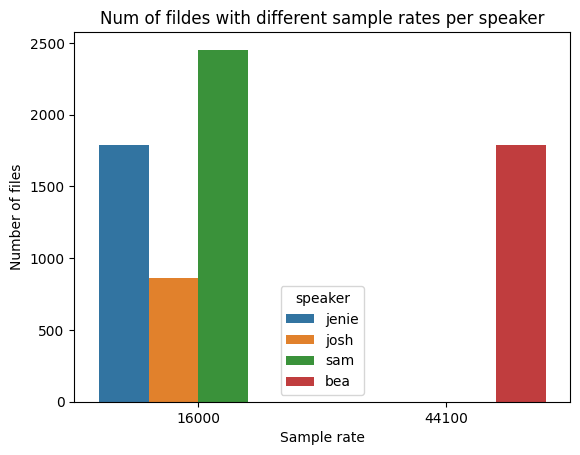

# Emotional Speech Synthesis Pipeline

# Описание проекта

Данный репозиторий является пайплайном обучения Emotional Speech Synthesis модели для одноголосой озвучки диалогов, генерируемых LLM.

Подробнее про задачу, для которой разрабатывается данный пайплайн можно прочесть в [ML System Design документе](docs/ml_system_design_doc.md).

# Содержание

- [Emotional Speech Synthesis Pipeline](#emotional-speech-synthesis-pipeline)
- [Описание проекта](#описание-проекта)
- [Содержание](#содержание)
- [Данные](#данные)
  - [MLS](#mls)
    - [Описание](#описание)
    - [Предобработка датасета](#предобработка-датасета)
  - [EmoV\_DB](#emov_db)
    - [Описание](#описание-1)
    - [Предобработка датасета](#предобработка-датасета-1)
- [Структура датасетов после обработки](#структура-датасетов-после-обработки)
- [Предобработка](#предобработка)
  - [Улучшение качества с помощью Resemble Enhancer'а](#улучшение-качества-с-помощью-resemble-enhancerа)

# Данные

Данный раздел приводит информацию о используемых в проекте датасетах и их первичной предобработке.

## MLS

Multilingual LibriSpeech (MLS) датасет представляет собой большой корпус аудио и текста для исследований в области Speech Synthesis. Датасет был составлен из аудиокниг, взятых с LibriVox.

Страница датасета: https://www.openslr.org/94/

### Описание

Весь датасет содержит 8 языков: (English, German, Dutch, Spanish, French, Italian, Portuguese, Polish)

Весь датасет содержит 8 языков: (English, German, Dutch, Spanish, French, Italian, Portuguese, Polish)

|Language | Download link (Original .flac) | Download link (Compresed .opus) |
|---|---|---|
|English|[mls_english.tar.gz](https://dl.fbaipublicfiles.com/mls/mls_english.tar.gz) (2.4T)|[mls_english_opus.tar.gz](https://dl.fbaipublicfiles.com/mls/mls_english_opus.tar.gz) (651G)|
|German|[mls_german.tar.gz](https://dl.fbaipublicfiles.com/mls/mls_german.tar.gz) (115G)|[mls_german_opus.tar.gz](https://dl.fbaipublicfiles.com/mls/mls_german_opus.tar.gz) (29G)|
|Dutch|[mls_dutch.tar.gz](https://dl.fbaipublicfiles.com/mls/mls_dutch.tar.gz) (86G)|[mls_dutch_opus.tar.gz](https://dl.fbaipublicfiles.com/mls/mls_dutch_opus.tar.gz) (23G)|
|French|[mls_french.tar.gz](https://dl.fbaipublicfiles.com/mls/mls_french.tar.gz) (61G)|[mls_french_opus.tar.gz](https://dl.fbaipublicfiles.com/mls/mls_french_opus.tar.gz) (16G)|
|Spanish|[mls_spanish.tar.gz](https://dl.fbaipublicfiles.com/mls/mls_spanish.tar.gz) (50G)|[mls_spanish_opus.tar.gz](https://dl.fbaipublicfiles.com/mls/mls_spanish_opus.tar.gz) (14G)|
|Italian|[mls_italian.tar.gz](https://dl.fbaipublicfiles.com/mls/mls_italian.tar.gz) (15G)|[mls_italian_opus.tar.gz](https://dl.fbaipublicfiles.com/mls/mls_italian_opus.tar.gz) (3.8G)|
|Portuguese|[mls_portuguese.tar.gz](https://dl.fbaipublicfiles.com/mls/mls_portuguese.tar.gz) (9.3G)|[mls_portuguese_opus.tar.gz](https://dl.fbaipublicfiles.com/mls/mls_portuguese_opus.tar.gz) (2.5G)|
|Polish|[mls_polish.tar.gz](https://dl.fbaipublicfiles.com/mls/mls_polish.tar.gz) (6.2G)|[mls_polish_opus.tar.gz](https://dl.fbaipublicfiles.com/mls/mls_polish_opus.tar.gz) (1.6G)|

Так же датасет содержит обученные LM 3/5 N-граммы. Подробнее - читайте в [источнике](https://www.openslr.org/94/).

Структура датасета
Данная структура приведена только для Английского корпуса. Предполагается, что структура не отличается для других языков.

Разархивировав датасет получаем следующую структуру:

```
mls_english_opus/
├── dev/
│ ├── audio/
│ │ ├── 10118/ # Speaker ID
│ │ │ ├── 7704/ # Book ID
│ │ │ │ ├── 10118_7704_000000.opus
│ │ │ │ ├── 10118_7704_000001.opus
│ │ │ │ └── ...
│ │ │ └── ...
│ │ └── ...
│ ├── segments.txt
│ └── transcripts.txt
├── test/
│ ├── audio/
│ │ ├── 10226/
│ │ │ ├── 10111/
│ │ │ │ ├── 10226_10111_000000.opus
│ │ │ │ └── ...
│ │ │ └── ...
│ │ └── ...
│ ├── segments.txt
│ └── transcripts.txt
├── train/
│ ├── limited_supervision/
│ │ ├── 1hr/
│ │ │ ├── 0/
│ │ │ │ └── handles.txt
│ │ │ └── ...
│ │ │ ├── 5/
│ │ │ │ └── handles.txt
│ │ └── 9hr/
│ │ └── handles.txt
│ ├── audio/
│ │ ├── 13357/
│ │ │ ├── 13994/
│ │ │ │ ├── 13357_13994_000000.opus
│ │ │ │ └── ...
│ │ │ └── ...
│ │ └── ...
│ ├── segments.txt
│ └── transcripts.txt
├── README
├── LICENSE
└── metainfo.txt
```

Содержимое **metainfo.txt**

```
head metainfo.txt
 SPEAKER   |   GENDER   | PARTITION  |  MINUTES   |  BOOK ID   |             TITLE              |            CHAPTER             |         Friar Anselmo
  10232    |     M      |   secret   |   17.148   |   10057    | Expression of the Emotions in Man and Animals | Ch. II: General Principles of Expression, continued
   9508    |     F      |   secret   |   9.347    |   10105    | Stephen: A Soldier of the Cross | Good Tidings Out of the Desert
   9508    |     F      |   secret   |   8.123    |   12959    |         Vanished Hand          | CHAPTER II - WHAT WAS WRITTEN
  10375    |     M      |   secret   |   10.803   |   10173    | Dutch Fairy Tales for Young Folks |   SANTA KLAAS AND BLACK PETE
  10375    |     M      |   secret   |   6.764    |   10244    | Grimm's Fairy Tales - Retold in One-Syllable Words |          Hans in Luck
  10655    |     M      |   secret   |   17.841   |   10173    | Dutch Fairy Tales for Young Folks | THE FARM THAT RAN AWAY AND CAME BACK
  10454    |     M      |   secret   |   1.782    |   10203    |             Verses             | The Cradle Tomb in Westminster Abbey
  10454    |     M      |   secret   |   2.316    |   10203    |             Verses             |          Commissioned
  10454    |     M      |   secret   |   2.362    |   10335    | Grand'ther Baldwin's Thanksgiving, with Other Ballads and Poems |         Friar Anselmo
```

Содержимое **segments.txt**

```
head segments.txt
4800_10003_000000       http://www.archive.org/download/rose_garden_husband_1508_librivox/rose_garden_husband_05_widdemer_64kb.mp3      401.76  417.57
4800_10003_000001       http://www.archive.org/download/rose_garden_husband_1508_librivox/rose_garden_husband_03_widdemer_64kb.mp3      238.58  252.82
4800_10003_000002       http://www.archive.org/download/rose_garden_husband_1508_librivox/rose_garden_husband_07_widdemer_64kb.mp3      1160.28 1174.41
4800_10003_000003       http://www.archive.org/download/rose_garden_husband_1508_librivox/rose_garden_husband_07_widdemer_64kb.mp3      599.02  612.41
4800_10003_000004       http://www.archive.org/download/rose_garden_husband_1508_librivox/rose_garden_husband_08_widdemer_64kb.mp3      363.34  376.76
4800_10003_000005       http://www.archive.org/download/rose_garden_husband_1508_librivox/rose_garden_husband_10_widdemer_64kb.mp3      993.58  1013.33
4800_10003_000006       http://www.archive.org/download/rose_garden_husband_1508_librivox/rose_garden_husband_04_widdemer_64kb.mp3      224.67  243.66
4800_10003_000007       http://www.archive.org/download/rose_garden_husband_1508_librivox/rose_garden_husband_09_widdemer_64kb.mp3      568.02  580.43
4800_10003_000008       http://www.archive.org/download/rose_garden_husband_1508_librivox/rose_garden_husband_12_widdemer_64kb.mp3      269.04  285.39
4800_10003_000009       http://www.archive.org/download/rose_garden_husband_1508_librivox/rose_garden_husband_14_widdemer_64kb.mp3      240.72  258.77
```

Содержимое **transcritps.txt**

```
head transcripts.txt
4800_10003_000000       oh my dear you must see him he expects you she answered almost gayly the procession of three moved down the long room towards a door phyllis's hand guiding the wheel-chair
4800_10003_000001       it was quite as much fun well almost as much hearing her as it would have been to play all of the contented and otherwise elderly people who inhabited the boarding-house with phyllis
4800_10003_000002       the man stole out and shut the door softly phyllis herself rose and went toward the window and busied herself in braiding up her hair there was almost silence in the room for a few minutes
4800_10003_000003       has it said phyllis it was like mrs harrington that careful planning of even where she should be put is mr harrington in his day-room now
4800_10003_000004       and she insisted that the pink paper stay on the electric lights after about a week of this phyllis suddenly remembered that she had not been selfish at all yet
4800_10003_000005       surprise i-i'm glad you like it said his wife shyly still backing away of course he'd like it said mrs de guenther's kind staccato voice behind him kiss your husband and tell him he's welcome home phyllis child
4800_10003_000006       you have everything that could be asked even to a certain cheerfulness of outlook which poor angela naturally lacks in a measure but-but what about me asked phyllis braithwaite a little piteously in answer to all this
4800_10003_000007       i've bought myself lots of things she defended herself most of this is really for me and-i can't help being good to him it's only common humanity
4800_10003_000008       his little crumpled black muzzle on the pillow close to allan's contented sleeping face she felt as if she wanted to cry the pathetic lack of interests which made the coming of a new little dog such an event
4800_10003_000009       she wondered afterwards how she could have spoken with that hard serenity how she could have gone steadily on with story after story poem after poem till allan's grip on her hands relaxed and he fell into a heavy tired sleep
```

Содержимое **handles.txt**

```
head handles.txt
13274_13499_000050
12648_13149_000053
11802_11360_000073
13274_13499_000037
12648_13149_000052
11802_11360_000065
13274_13499_000031
12648_13149_000015
11802_11360_000032
13274_13499_000003
```

### Предобработка датасета

Чтобы предобработать датасет скачайте и распакуйте его в директорию (Например *data/raw/mls_oput_english*) и запустите скрипт:

```
python -m src.data.MLS.preprocess --dataset_path [DATASET_DIRECTORY] --output_path [SAVE_DIRECTORY] --change_sample_rate True --result_sample_rate 44100 --n_files 3600
```

Результатом будет сформатированный под [принятую структуру](#структура-датасетов-после-обработки) датасет в директории сохранения.

Описание всех параметров представлено ниже:
- **--dataset_path** - Path to MLS dataset
- **--output_path** - Path to output directory
- **--change_sample_rate** - Resample all audiofiles to specified sample rate. *Default: False*
- **--result_sample_rate** - Resample all audiofiles to specified sample rate. *Default: 44100*
- **--n_jobs** - Number of parallel jobs. If set to -1, use all available CPU cores. *Default: -1*
- **--cache_dir** - Directory in output path to store cache files. *Default: .cache*
- **--n_files** - Number of files to process. If set to -1, process all files of speaker. Mean duration of files is 15s, so if you want to process 1h of speech, set this to 3600. If there not enough files, all files will be processed. *Default: 3600*
- **--cache_every_n_speakers** - Number of speakers to be processed before cache is updated. *Default: 100*


## EmoV_DB

EmoV_DB представляет собой набор записанных актерами фраз различного настроения. 

### Описание

Большая часть из аудиофайлов записана с частотой дискретизации 16000. Подробнее представлено на диаграммах ниже:



Датасет представлен архивами в которых содержатся аудио по конкретному спикеру и эмоции. Всего архивов 18:

```
bea_Amused     bea_Neutral   jenie_Angry      jenie_Sleepy  josh_Sleepy  sam_Disgusted
bea_Angry      bea_Sleepy    jenie_Disgusted  josh_Amused   sam_Amused   sam_Neutral
bea_Disgusted  jenie_Amused  jenie_Neutral    josh_Neutral  sam_Angry    sam_Sleepy
```

Название аудиофайлов имеет следующую структуру: *[emotion]_[annotation_doc file range]_[sequence_number].wav*. Например anger_449-476_0463.wav.

Сами тексты можно найти по этой ссылке: http://www.festvox.org/cmu_arctic/cmuarctic.data

### Предобработка датасета

Чтобы предобработать датасет скачайте и распакуйте его в директорию (Например *data/raw/EmoV_DB*) и запустите скрипт:

```
python -m src.data.EmoV_DB.preprocess --dataset_path [DATASET_DIRECTORY] --output_path [SAVE_DIRECTORY] --change_sample_rate True --result_sample_rate 44100 --download_cmuarctic_data True
```

Результатом будет сформатированный под [принятую структуру](#структура-датасетов-после-обработки) датасет в директории сохранения.

Описание всех параметров представлено ниже:
- **--dataset_path** - Path to EmoV_DB dataset
- **--output_path** - Path to output directory
- **--cmuarctic_data_path** - Path to 'cmuarctic.data' file with texts for audiofiles. *Default: None*
- **--cmuarctic_url** - Url to 'cmuarctic.data' file to be able to download this file if it doesn't exist. *Default: http://www.festvox.org/cmu_arctic/cmuarctic.data*
- **--download_cmuarctic_data** - Download 'cmuarctic.data' file if it doesn't exist to input dataset path. *Default: False*
- **--change_sample_rate** - Resample all audiofiles to specified sample rate. *Default: False*
- **--result_sample_rate** - Resample all audiofiles to specified sample rate. *Default: 44100*
- **--n_jobs** - Number of parallel jobs. If set to -1, use all available CPU cores. *Default: -1*

# Структура датасетов после обработки

Все данные должны быть приведены к одному формату, представленному ниже:

```
all_datasets/                # Главная папка с несколькими мультиспикерными датасетами
│
├── metadata.csv             # Главная метадата, содержащая пути ко ВСЕМ wav файлам в текущем датасете
│
├── EmoV_DB/                 # Папка мультиспикерного датасета EmoV_DB
|   ├── metadata.csv         # Метадата содержащая пути ко всем файлам внутри датасета EmoV_DB
│   ├── speaker_1/           # Папка спикера
│   │   └── wavs/            # Папка с аудиофайлами или их подкатегориями
│   │       ├── file1.wav
│   │       └── ...
│   ├── speaker_2/
│   |   └── wavs/
│   |       ├── subfolder/   # Подпапка с аудиофайлами, например, по книгам (опционально - если есть такое разделение)
│   |       |   ├── file3.wav
│   |       |   └── ...
|   |       ├── file11.wav
|   |       └── ...
|   ├── ...
|   └── wavs                 # Папка с аудиофайлами без спикеров
|       ├── no_speaker1.wav
|       └── ...
|
└── MLS/                     # Папка мультиспикерного датасета MLS
    ├── metadata.csv
    ├── speaker_1/
    │   └── wavs/
    │       ├── file1.wav
    |       └── ...
    ├── speaker_2/
    |   └── wavs/
    |       ├── file2.wav
    |       └── ...
    └── wavs                   # Папка с аудиофайлами без спикеров
        ├── no_speaker1.wav
        └── ...
```

Файл metadata.csv должен соответствовать следующей структуре (all_datasets/EmoV_DB/metadata.csv):

| path_to_wav                        | speaker_id | text                   |
| ---------------------------------- | ---------- | ---------------------- |
| speaker_1/wavs/file1.wav           | 0          | Hello world            |
| speaker_2/wavs/subfolder/file3.wav | 1          | It's me, Mario         |
| speaker_2/wavs/file11.wav          | 1          | Mario time!            |
| wavs/no_speaker1.wav               | -1         | Keep you waiting, huh? |

**Для аудио с отсутствующей информацией о спикере проставляется ID -1.**

*Speaker_id* и *path_to_wav* являются локальными в пределах датасета. Пример для сравнения (all_datasets/metadata.csv)

| path_to_wav                                | speaker_id | text                   |
| ------------------------------------------ | ---------- | ---------------------- |
| EmoV_DB/speaker_1/wavs/file1.wav           | 0          | Hello world            |
| EmoV_DB/speaker_2/wavs/subfolder/file3.wav | 1          | It's me, Mario         |
| EmoV_DB/speaker_2/wavs/file11.wav          | 1          | Mario time!            |
| EmoV_DB/wavs/no_speaker1.wav               | -1         | Keep you waiting, huh? |
| MLS/speaker_1/wavs/file1.wav               | 2          | Nanomachines, son!     |
| MLS/speaker_2/wavs/file2.wav               | 3          | Leeroooooy Jenkins!    |
| MLS/wavs/no_speaker1.wav                   | -1         | Very dramatic, Uther.  |

Так же стоит учитывать следующие замечания:
- Аудио файлы **должны быть** в формате .wav.
- Аудио файлы **должны быть** в локальной wavs директории.
- Подразумевается что **нет несоответствий** между информацией в metadata.csv и соответствующей структуре директорий.
- Аудиофайлы **должны быть** одного sample rate
- Аудиофайлы **представлены с 1 каналом (mono).**
- .csv файлы **должны быть** сохранены с параметрами **sep='|', index=False**
- Колонки для .csv файлов **должны быть** в порядке *path_to_wav | text | speaker_id* для поддержания обратной совместимости

# Предобработка

## Улучшение качества с помощью Resemble Enhancer'а

Для улучшения качества голоса и избавления от внешних шумов используется [resemble-enhancer](https://github.com/resemble-ai/resemble-enhance/tree/main). Данный инструмент инкапсулирован в Triton Inference Server, подробнее про сервер можно прочитать в [официальных туториалах](https://github.com/triton-inference-server/tutorials). 

Данный инструмент обрабатывает **только .wav файлы** и результатом являются .wav файлы с частотой дикретизации **44.1kHZ** с одним каналом (**mono**).


Для обработки требуется сперва поднять Docker контейнер с Enhancer'ом

Билд:

```
docker build -t resemble-enhancer-triton-container -f ./triton/enhancer/Dockerfile ./triton/enhancer
```

Запуск контейнера:

```bash
docker run -it --network host --name Esemble-Enhancer-Triton-Server --gpus device=0 resemble-enhancer-triton-container
```

Запуск сервера внутри контейнера:

```bash
tritonserver --model-repository /models --http-port=8520 --grpc-port=8521 --metrics-port=8522
```

Обработка Enhancer'ом [стандартизированного датасета](#структура-датасетов-после-обработки):

```
python -m src.preprocessing.enhance --triton-address 127.0.0.1 --triton-port 8520 --dataset-path [PATH_TO_ORIGIN_DATASET] --output-path [SAVE_PATH]
```

Описание всех параметров представлено ниже:
- **--dataset_path** - Path to processing dataset.
- **--output_path** - Path where the enhanced dataset will be saved.
- **--chunk_duration** - The duration in seconds by which the enhancer will divide your sample. Default: 30.0
- **--chunk_overlap** - The duration of overlap between adjacent samples. Does not enlarge chunk_duration. Default: 1.0
- **--model_name** - The name of Triton Inference Server model. Default: enhancer_ensemble
- **--batch_size** - The size of the batch of async tasks every job will process
- **--triton_address** - The Triton Inference Server address
- **--triton_port** - The Triton Inference Server port
- **--n_jobs** - Number of parallel jobs. If -1 specified, use all available CPU cores.