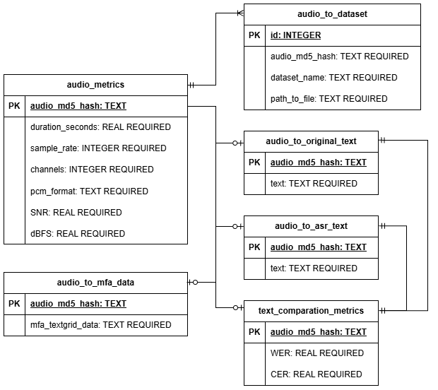

# Пайплайн обработки речевых данных

# Описание проекта

Данный репозиторий содержит пайплайн для обработки речевых данных, включающий в себя сбор метаданных, фильтрацию и предобработку аудиофайлов. Пайплайн поддерживает работу как с локальными файлами, так и с облачным хранилищем через LakeFS/S3.

Подробнее про задачу и архитектуру пайплайна можно прочесть в [ML System Design документе](docs/ml_system_design_doc.md).

# Содержание

- [Пайплайн обработки речевых данных](#пайплайн-обработки-речевых-данных)
- [Описание проекта](#описание-проекта)
- [Содержание](#содержание)
- [Формирование стандартизированного формата](#формирование-стандартизированного-формата)
  - [Предобработка датасета MLS](#предобработка-датасета-mls)
  - [Предобработка датасета EmoV_DB](#предобработка-датасета-emov_db)
  - [Предобработка директории с аудиофайлами](#предобработка-директории-с-аудиофайлами)
- [Работа с объектным хранилищем S3 и LakeFS](#работа-с-объектным-хранилищем-s3-и-lakefs)
  - [Конфигурация](#конфигурация)
  - [Загрузка данных](#загрузка-данных)
    - [Загрузка любой директории](#загрузка-любой-директории)
- [Сохранение метаданных о датасетах](#сохранение-метаданных-о-датасетах)
  - [Требуемая структура реляционной базы данных](#требуемая-структура-реляционной-базы-данных)
  - [Сбор аудио метаданных](#сбор-аудио-метаданных)
  - [Сбор текстовых метаданных](#сбор-текстовых-метаданных)
  - [Распознавание произнесенного текста с помощью ASR](#распознавание-произнесенного-текста-с-помощью-asr)
    - [Обработка датасета с помощью ASR](#обработка-датасета-с-помощью-asr)
  - [Вычисление WER/CER между ASR и Original текстами](#вычисление-wercer-между-asr-и-original-текстами)
  - [Улучшение качества с помощью Resemble Enhancer'а](#улучшение-качества-с-помощью-resemble-enhancerа)
    - [Запуск Enhancer'а](#запуск-enhancerа)
    - [Обработка Enhancer'ом стандартизированного датасета](#обработка-enhancerом-стандартизированного-датасета)
  - [Получение информации о интонационных паузах с помощью Montreal Forced Aligner](#получение-информации-о-интонационных-паузах-с-помощью-montreal-forced-aligner)
    - [Установка зависимостей](#установка-зависимостей)
    - [Обработка датасета с помощью MFA](#обработка-датасета-с-помощью-mfa)
  - [Фильтрация датасетов по собранным метаданным](#фильтрация-датасетов-по-собранным-метаданным)

# Формирование стандартизированного формата

## Предобработка датасета MLS

Для предобработки датасета MLS скачайте и распакуйте его в директорию (например, *data/raw/mls_oput_english*) и запустите скрипт:

```bash
python -m src.data.MLS.preprocess --dataset-path [DATASET_DIRECTORY] --output-path [SAVE_DIRECTORY] --change-sample-rate True --result-sample-rate 44100 --n-files 3600
```

Результатом будет сформатированный под [принятую структуру](docs/ml_system_design_doc.md#32-стандартизованный-формат-хранения-данных) датасет в директории сохранения.

Описание параметров:
- **--dataset-path** - Путь к датасету MLS
- **--output-path** - Путь к директории для сохранения результатов
- **--change-sample-rate** - Изменить частоту дискретизации всех аудиофайлов. *По умолчанию: False*
- **--result-sample-rate** - Целевая частота дискретизации. *По умолчанию: 44100*
- **--n-jobs** - Количество параллельных процессов. -1 означает использование всех доступных ядер CPU. *По умолчанию: -1*
- **--cache-dir** - Директория для кэширования файлов. *По умолчанию: .cache*
- **--n-files** - Количество файлов для обработки. -1 означает обработку всех файлов. Средняя длительность файла 15с, поэтому для обработки 1 часа речи установите значение 3600. *По умолчанию: 3600*
- **--cache-every-n-speakers** - Количество спикеров для обработки перед обновлением кэша. *По умолчанию: 100*

## Предобработка датасета EmoV_DB

Для предобработки датасета EmoV_DB скачайте и распакуйте его в директорию (например, *data/raw/EmoV_DB*) и запустите скрипт:

```bash
python -m src.data.EmoV_DB.preprocess --dataset-path [DATASET_DIRECTORY] --output-path [SAVE_DIRECTORY] --change-sample-rate True --result-sample-rate 44100 --download-cmuarctic-data True
```

Результатом будет сформатированный под [принятую структуру](docs/ml_system_design_doc.md#32-стандартизованный-формат-хранения-данных) датасет в директории сохранения.

Описание параметров:
- **--dataset-path** - Путь к датасету EmoV_DB
- **--output-path** - Путь к директории для сохранения результатов
- **--cmuarctic-data-path** - Путь к файлу 'cmuarctic.data' с текстами для аудиофайлов. *По умолчанию: None*
- **--cmuarctic-url** - URL для скачивания файла 'cmuarctic.data'. *По умолчанию: http://www.festvox.org/cmu_arctic/cmuarctic.data*
- **--download-cmuarctic-data** - Скачать файл 'cmuarctic.data' если он отсутствует. *По умолчанию: False*
- **--change-sample-rate** - Изменить частоту дискретизации всех аудиофайлов. *По умолчанию: False*
- **--result-sample-rate** - Целевая частота дискретизации. *По умолчанию: 44100*
- **--n-jobs** - Количество параллельных процессов. -1 означает использование всех доступных ядер CPU. *По умолчанию: -1*

## Предобработка директории с аудиофайлами

Для обработки неструктурированных аудиофайлов в одной директории используйте следующий скрипт:

```bash
python -m src.datasets.audio_folder --folder-path [PATH_TO_DIRECTORY_WITH_AUDIOFILES] --save-path [STRUCTURED_DATASET_SAVE_PATH]
```

Пример структуры входных данных:
```
raw_audio_path/
├── audio_1.mp3
├── some_directory/
│   ├── audio_2.ogg
│   └── another_directory/
│       └── audio_3.flac
└── and_another_one_directory/
    └── audio_4.wav
```

Стандартный запуск создаст следующую структуру:
```
dataset_path/
├── wavs/
│   └── audio_1.wav
├── speaker_0/
│   └── wavs/
│       ├── audio_2.wav
│       └── another_directory/
│           └── audio_3.wav
├── speaker_1/
│   └── wavs/
│       └── audio_4.wav
└── metadata.csv
```

`metadata.csv` будет содержать следующую информацию:
| path_to_wav                                  | speaker_id |
| -------------------------------------------- | ---------- |
| wavs/audio_1.wav                             | -1         |
| speaker_0/wavs/audio_2.wav                   | 0          |
| speaker_0/wavs/another_directory/audio_3.wav | 0          |
| speaker_1/wavs/audio_4.wav                   | 1          |

Описание параметров:
- **--folder-path** - Путь к директории с аудиофайлами
- **--single-speaker** - Все файлы принадлежат одному спикеру? *По умолчанию: False*
- **--unknown-speaker** - Все файлы принадлежат неизвестному спикеру? *По умолчанию: False*
- **--overwrite** - Перезаписать существующие файлы? *По умолчанию: False*
- **--save-path** - Путь для сохранения отформатированного датасета
- **--n-jobs** - Количество параллельных процессов. -1 означает использование всех доступных ядер CPU. *По умолчанию: -1*

# Работа с объектным хранилищем S3 и LakeFS

## Конфигурация

Проект поддерживает работу с объектными хранилищами через LakeFS. Для работы с LakeFS используется библиотека [`lakefs-spec`](https://github.com/aai-institute/lakefs-spec).

Необходимые параметры для работы с LakeFS:
```
LAKEFS_ADDRESS=http://[YOUR_IP_ADDRESS]
LAKEFS_PORT=[YOUR_LAKEFS_PORT]
LAKEFS_ACCESS_KEY_ID=[YOUR_ACCESS_KEY_ID]
LAKEFS_SECRET_KEY=[YOUR_SECRET_KEY]
```

Рекомендуется указать эти параметры в файле `.env`.

## Загрузка данных

### Загрузка любой директории

Для загрузки файлов можно использовать [lakefsclt](https://docs.lakefs.io/reference/cli.html) или скрипт `src/datasets/load_diretory_to_lakefs.py`:

```bash
python -m src.datasets.load_directory_to_lakefs --path [PATH_TO_YOUR_DIRECTORY] --repository-name [NAME_OF_YOUR_REPOSITORY]
```

# Сохранение метаданных о датасетах

## Требуемая структура реляционной базы данных

Для работы скриптов требуется PostgreSQL со следующей схемой:



Параметры подключения к базе данных должны быть указаны в файле `.env`:
```
POSTGRES_USER=[POSTGRES_USER]
POSTGRES_PASSWORD=[POSTGRES_PASSWORD]
POSTGRES_DB=[POSTGRES_DB_NAME]
POSTGRES_PORT=5432
POSTGRES_ADDRESS=localhost
```

## Сбор аудио метаданных

Для сбора метаданных с датасета используйте команду:

```bash
python -m src.metrics_collection.collect_audio_metrics local --dataset-path [PATH_TO_DATASET]
```

Скрипт обработает все файлы, которые еще не были добавлены в базу данных, и сохранит их аудио метаданные.

Описание параметров:
- **Общие**:
  - **--metadata_path** - Путь к файлу метаданных. *По умолчанию: [DATASET_PATH]/metadata.csv*
  - **--overwrite** - Перезаписать существующие метрики? *По умолчанию: False*
  - **--database-address** - Адрес базы данных. *Переменная окружения: POSTGRES_ADDRESS*
  - **--database-port** - Порт базы данных. *Переменная окружения: POSTGRES_PORT*
  - **--database-user** - Имя пользователя базы данных. *Переменная окружения: POSTGRES_USER*
  - **--database-password** - Пароль базы данных. *Переменная окружения: POSTGRES_PASSWORD*
  - **--database-name** - Имя базы данных. *Переменная окружения: POSTGRES_DB*
  - **--n-jobs** - Количество параллельных процессов. -1 означает использование всех доступных ядер CPU. *По умолчанию: -1*

- **local**:
  - **--dataset-path** - Путь к обрабатываемым данным

- **s3**:
  - **--LakeFS-address** - Адрес LakeFS. *Переменная окружения: LAKEFS_ADDRESS*
  - **--LakeFS-port** - Порт LakeFS. *Переменная окружения: LAKEFS_PORT*
  - **--ACCESS-KEY-ID** - Ключ доступа LakeFS. *Переменная окружения: LAKEFS_ACCESS_KEY_ID*
  - **--SECRET-KEY** - Секретный ключ LakeFS. *Переменная окружения: LAKEFS_SECRET_KEY*
  - **--repository-name** - Имя репозитория LakeFS
  - **--branch-name** - Имя ветки. *По умолчанию: main*

## Сбор текстовых метаданных

Для добавления соответствий между аудиофайлами и произносимым текстом используйте команду:

```bash
python -m src.metrics_collection.collect_audio_text local --dataset-path [PATH_TO_DATASET]
```

**Требуется наличие поля "text"** в `metadata.csv`.

Описание параметров аналогично параметрам сбора аудио метаданных.

## Распознавание произнесенного текста с помощью ASR

Для оценки качества голоса используется ASR. Оригинальный текст сравнивается с распознанным по метрикам WER и CER.

### Обработка датасета с помощью ASR

После запуска ASR Triton Inference Server выполните:

```bash
python -m src.preprocessing.asr_processing --triton-port 127.0.0.1 --triton-port 9870 local --dataset-path [PATH_TO_DATASET]
```

Описание параметров:
- **Общие**:
  - **--metadata-path** - Путь к файлу метаданных. *По умолчанию: [DATASET_PATH]/metadata.csv*
  - **--triton-address** - Адрес Triton Inference Server. *По умолчанию: localhost*
  - **--triton-port** - Порт Triton Inference Server. *По умолчанию: 8000*
  - **--batch-size** - Размер батча для обработки аудиофайлов. *По умолчанию: 10*
  - **--overwrite** - Перезаписать существующие метрики? *По умолчанию: False*
  - **--database-address** - Адрес базы данных. *Переменная окружения: POSTGRES_ADDRESS*
  - **--database-port** - Порт базы данных. *Переменная окружения: POSTGRES_PORT*
  - **--database-user** - Имя пользователя базы данных. *Переменная окружения: POSTGRES_USER*
  - **--database-password** - Пароль базы данных. *Переменная окружения: POSTGRES_PASSWORD*
  - **--database-name** - Имя базы данных. *Переменная окружения: POSTGRES_DB*
  - **--n-jobs** - Количество параллельных процессов. -1 означает использование всех доступных ядер CPU. *По умолчанию: -1*

- **local**:
  - **--dataset-path** - Путь к обрабатываемым данным

- **s3**:
  - **--LakeFS-address** - Адрес LakeFS. *Переменная окружения: LAKEFS_ADDRESS*
  - **--LakeFS-port** - Порт LakeFS. *Переменная окружения: LAKEFS_PORT*
  - **--ACCESS-KEY-ID** - Ключ доступа LakeFS. *Переменная окружения: LAKEFS_ACCESS_KEY_ID*
  - **--SECRET-KEY** - Секретный ключ LakeFS. *Переменная окружения: LAKEFS_SECRET_KEY*
  - **--repository-name** - Имя репозитория LakeFS
  - **--branch-name** - Имя ветки. *По умолчанию: main*

## Вычисление WER/CER между ASR и Original текстами

Для вычисления метрик WER/CER выполните:

```bash
python -m src.metrics_collection.calculate_wer_cer local --dataset-path [PATH_TO_DATASET]
```

Описание параметров аналогично параметрам сбора аудио метаданных.

## Улучшение качества с помощью Resemble Enhancer'а

Для улучшения качества голоса используется [resemble-enhancer](https://github.com/resemble-ai/resemble-enhance/tree/main). Инструмент обрабатывает **только .wav файлы** и возвращает файлы с частотой дискретизации **44.1kHZ** и одним каналом (**mono**).

### Запуск Enhancer'а

```bash
docker compose -f triton/enhancer/compose.yaml up
```

Можно изменить порты Triton'а или количество доступных видеокарт в файле `.env`:
```
docker compose --env-file .env -f triton/enhancer/compose.yaml up
```

Порты по умолчанию:
- TRITON_HTTP_PORT: 8520
- TRITON_GRPC_PORT: 8521
- TRITON_METRICS_PORT: 8522

### Обработка Enhancer'ом стандартизированного датасета

```bash
python -m src.preprocessing.enhance --triton-address 127.0.0.1 --triton-port 8520 local_to-local --input-path [PATH_TO_ORIGIN_DATASET] --output-path [SAVE_PATH]
```

Описание параметров:
- **Общие**:
  - **--metadata-path** - Путь к файлу метаданных. *По умолчанию: [DATASET_PATH]/metadata.csv*
  - **--output-path** - Путь для сохранения обработанного датасета
  - **--chunk-duration** - Длительность чанка в секундах. *По умолчанию: 30.0*
  - **--chunk-overlap** - Длительность перекрытия между соседними чанками. *По умолчанию: 1.0*
  - **--model-name** - Имя модели Triton Inference Server. *По умолчанию: enhancer_ensemble*
  - **--batch-size** - Размер батча для асинхронных задач
  - **--triton-address** - Адрес Triton Inference Server
  - **--triton-port** - Порт Triton Inference Server
  - **--n-jobs** - Количество параллельных процессов. -1 означает использование всех доступных ядер CPU

- **local_to_local**:
  - **--input-path** - Путь к обрабатываемому датасету
  - **--output-path** - Путь для сохранения результатов

- **local_to_s3**:
  - **--input-path** - Путь к обрабатываемому датасету
  - **--output-repository-name** - Имя репозитория LakeFS для сохранения результатов
  - **--output-branch-name** - Имя ветки для сохранения результатов. *По умолчанию: main*

- **s3_to_local**:
  - **--input-repository-name** - Имя репозитория LakeFS с исходным датасетом
  - **--input-branch-name** - Имя ветки с исходным датасетом. *По умолчанию: main*
  - **--output-path** - Путь для сохранения результатов

- **s3_to_s3**:
  - **--input-repository-name** - Имя репозитория LakeFS с исходным датасетом
  - **--input-branch-name** - Имя ветки с исходным датасетом. *По умолчанию: main*
  - **--output-repository-name** - Имя репозитория LakeFS для сохранения результатов
  - **--output-branch-name** - Имя ветки для сохранения результатов. *По умолчанию: main*

## Получение информации о интонационных паузах с помощью Montreal Forced Aligner

Montreal Forced Aligner позволяет получить разметку времени произнесения каждого слова/фонемы.

### Установка зависимостей

Для работы с MFA используется Docker контейнер:

```bash
docker run -it --name MFA_Processing --network host -v [PATH_TO_DATA_TO_PROCESS]:/workspace/data -v $(pwd):/workspace mmcauliffe/montreal-forced-aligner
```

Установите дополнительные зависимости:
```bash
pip install textgrid, click, SQLAlchemy, psycopg, psycopg2, python-dotenv, pyyaml
```

### Обработка датасета с помощью MFA

Внутри контейнера выполните:

```bash
cd /workspace
python -m src.preprocessing.mfa_processing --dataset-path ./data/[YOUR_DATASET]
```

Описание параметров:
- **--dataset-path** - Путь к обрабатываемому датасету
- **--metadata_path** - Путь к файлу метаданных. *По умолчанию: [DATASET_PATH]/metadata.csv*
- **--overwrite** - Перезаписать существующие метрики? *По умолчанию: False*
- **--database-address** - Адрес базы данных. *Переменная окружения: POSTGRES_ADDRESS*
- **--database-port** - Порт базы данных. *Переменная окружения: POSTGRES_PORT*
- **--database-user** - Имя пользователя базы данных. *Переменная окружения: POSTGRES_USER*
- **--database-password** - Пароль базы данных. *Переменная окружения: POSTGRES_PASSWORD*
- **--database-name** - Имя базы данных. *Переменная окружения: POSTGRES_DB*
- **--n-jobs** - Количество параллельных процессов. -1 означает использование всех доступных ядер CPU. *По умолчанию: -1*

## Фильтрация датасетов по собранным метаданным

Для фильтрации датасета по собранным метаданным используйте команду:

```bash
python -m src.filtration.database_filtration --path-to-config [PATH_TO_CONFIG] local --dataset-path [PATH_TO_DATASET] 
```

Описание параметров:
- **Общие**:
  - **--path-to-config** - Путь к YAML файлу с конфигурацией фильтров
  - **--config-name** - Имя конфигурации в YAML файле. *По умолчанию: default*
  - **--database-address** - Адрес базы данных. *Переменная окружения: POSTGRES_ADDRESS*
  - **--database-port** - Порт базы данных. *Переменная окружения: POSTGRES_PORT*
  - **--database-user** - Имя пользователя базы данных. *Переменная окружения: POSTGRES_USER*
  - **--database-password** - Пароль базы данных. *Переменная окружения: POSTGRES_PASSWORD*
  - **--database-name** - Имя базы данных. *Переменная окружения: POSTGRES_DB*
  - **--save-path** - Путь для сохранения отфильтрованного metadata.csv. *По умолчанию: filtered_metadata.csv*
  - **--include-text** - Добавить колонку "text" в metadata.csv? *По умолчанию: False*

- **local**:
  - **--dataset-path** - Путь к обрабатываемым данным

- **s3**:
  - **--LakeFS-address** - Адрес LakeFS. *Переменная окружения: LAKEFS_ADDRESS*
  - **--LakeFS-port** - Порт LakeFS. *Переменная окружения: LAKEFS_PORT*
  - **--ACCESS-KEY-ID** - Ключ доступа LakeFS. *Переменная окружения: LAKEFS_ACCESS_KEY_ID*
  - **--SECRET-KEY** - Секретный ключ LakeFS. *Переменная окружения: LAKEFS_SECRET_KEY*
  - **--repository-name** - Имя репозитория LakeFS
  - **--branch-name** - Имя ветки. *По умолчанию: main*

Пример конфигурации фильтров (`filtration_config.yaml`):
```yaml
default:
  sample_rate: 44100
  channels: 1
  duration:
    min: 1
    max: 15
  SNR: 
    min: null
    max: null
  dBFS:
    min: null
    max: null
  CER: 
    min: null
    max: null
  WER: 
    min: null
    max: null
  CPS:
    min: null
    max: null
  samples_per_speaker:
    min: null
    max: null
  minutes_per_speaker:
    min: null
    max: null
  text_len_per_duration:
    min: null
    max: null
  use_unknown_speakers: True
  only_with_ASR_texts: False
  only_with_Original_texts: False
```

Описание параметров фильтрации:
- **sample_rate** - Частота дискретизации аудио
- **channels** - Количество каналов аудио
- **duration** - Длительность аудио в секундах
- **SNR** - Отношение сигнал/шум
- **dBFS** - Уровень громкости в dBFS
- **CER** - Character Error Rate между ASR и оригинальным текстом
- **WER** - Word Error Rate между ASR и оригинальным текстом
- **CPS** - Characters Per Second (символов в секунду) для ASR текста
- **samples_per_speaker** - Количество сэмплов на одного спикера
- **minutes_per_speaker** - Количество минут на одного спикера
- **text_len_per_duration** - Отношение длины текста к длительности аудио
- **use_unknown_speakers** - Использовать сэмплы с неизвестными спикерами
- **only_with_ASR_texts** - Использовать только сэмплы с ASR текстами
- **only_with_Original_texts** - Использовать только сэмплы с оригинальными текстами

Для каждого числового параметра можно указать:
- **min** - минимальное значение
- **max** - максимальное значение

Если значение не указано (null), фильтр не применяется.